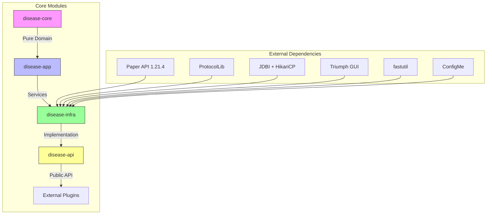

# Disease Outbreak Plugin - Comprehensive Architecture Design

## Table of Contents
1. [Module Structure and Dependencies](#module-structure-and-dependencies)
2. [Domain Layer Architecture (disease-core)](#domain-layer-architecture)
3. [Application Layer Architecture (disease-app)](#application-layer-architecture)
4. [Infrastructure Layer Architecture (disease-infra)](#infrastructure-layer-architecture)
5. [API Layer Architecture (disease-api)](#api-layer-architecture)
6. [Class Diagrams for Core Systems](#class-diagrams)
7. [Sequence Diagrams for Key Workflows](#sequence-diagrams)
8. [Database Schema Design](#database-schema)
9. [Performance Optimization Strategies](#performance-optimization)
10. [Integration Points Documentation](#integration-points)

## Module Structure and Dependencies



### Module Breakdown:

**disease-core (Domain Layer)**
- Pure Java domain models and business logic
- No Bukkit/Paper dependencies
- Contains core disease mechanics, transmission logic, and outbreak algorithms
- Follows DDD (Domain-Driven Design) principles

**disease-app (Application Layer)**
- Service interfaces and orchestration
- Business process coordination
- Transaction management
- Event publishing and handling
- Depends only on disease-core

**disease-infra (Infrastructure Layer)**
- Paper API implementation
- Database persistence (JDBI + HikariCP)
- ProtocolLib integration for effects
- Triumph GUI implementation
- Configuration management (ConfigMe)
- Folia-safe scheduling
- Depends on disease-app and external libraries

**disease-api (API Layer)**
- Public API for other plugins
- Event bus for plugin integration
- API documentation and versioning
- Depends on disease-app only

## Domain Layer Architecture (disease-core)

### Core Domain Models

```mermaid
classDiagram
    class Disease {
        +String id
        +String name
        +String description
        +DiseaseStage[] stages
        +TransmissionType[] transmissionTypes
        +Symptom[] symptoms
        +double baseInfectionRate
        +double baseDuration
        +double baseSeverity
        +calculateInfectionChance(PlayerContext)
        +calculateProgression(PlayerContext)
        +getCurrentStage(PlayerContext)
    }

    class DiseaseStage {
        +String name
        +int stageNumber
        +double durationMultiplier
        +double severityMultiplier
        +double infectionRateMultiplier
        +Symptom[] additionalSymptoms
    }

    class TransmissionType {
        <<enum>>
        AIRBORNE
        CONTACT
        FLUID
        VECTOR
        ENVIRONMENTAL
    }

    class Symptom {
        +String id
        +String name
        +String description
        +double severity
        +Effect[] effects
        +applyToPlayer(PlayerContext)
    }

    class Outbreak {
        +String id
        +Disease disease
        +OutbreakScope scope
        +Location[] affectedLocations
        +Biome[] affectedBiomes
        +double currentIntensity
        +double spreadRate
        +OutbreakStatus status
        +calculateSpread()
        +updateIntensity()
        +isActive()
    }

    class OutbreakScope {
        <<enum>>
        LOCAL
        REGIONAL
        BIOME
        GLOBAL
    }

    class PlayerInfection {
        +UUID playerId
        +Disease disease
        +DiseaseStage currentStage
        +long infectionStartTime
        +double currentSeverity
        +boolean isImmunized
        +ImmunityType immunityType
        +progressInfection()
        +applySymptoms()
        +checkRecovery()
    }

    class ImmunityType {
        <<enum>>
        NATURAL
        VACCINE
        TEMPORARY
    }

    Disease "1" *-- "1..*" DiseaseStage : contains
    Disease "1" *-- "1..*" TransmissionType : has
    Disease "1" *-- "1..*" Symptom : causes
    Outbreak "1" -- "1" Disease : of
    PlayerInfection "1" -- "1" Disease : infected with
    PlayerInfection "1" -- "1" DiseaseStage : at